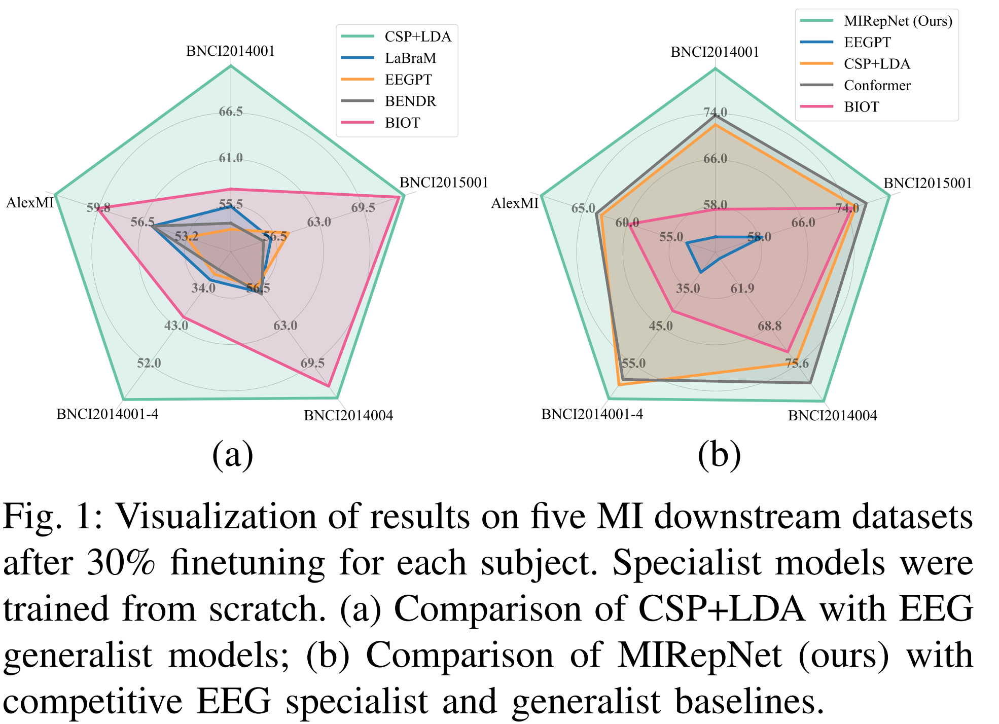
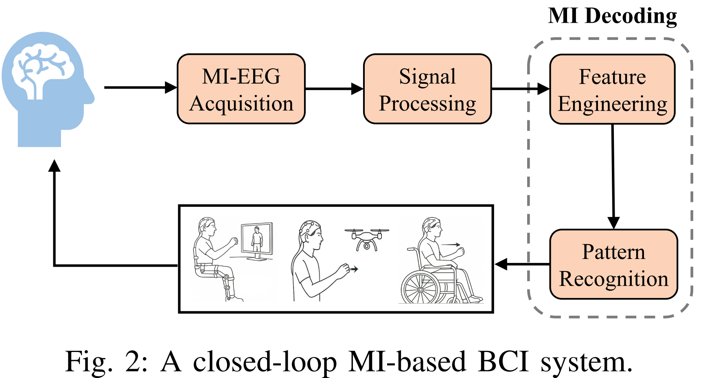
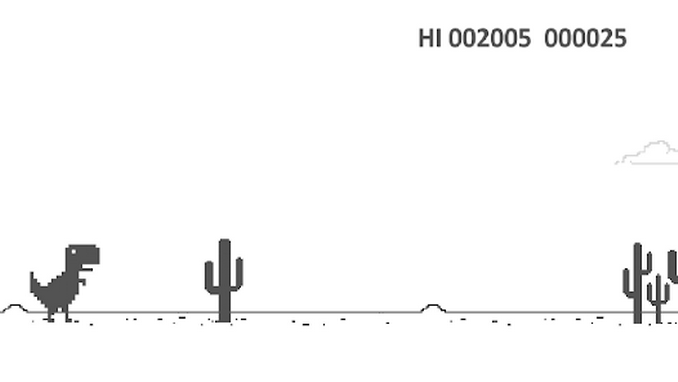

# Development of a Video Game with ML-decoded EEG Inputs

## 1. Context
    
<p align="justify"> This project is part of the broader development of a startup project (NeuralQuest) whose objective will be to develop video games where commands are obtained from EEG signals. This would make video games accessible to people suffering from various disabilities that prevent them from using traditional input peripherals (controllers, keyboards, etc.). </p>

## 2. Previous work

There have been 3 hackathons done by the team working on the startup idea.

2 of them used a VR headset and a 8-channels UNICORN EEG headset (g.tec).  
You can access video presentations of their game here : 

- [https://www.linkedin.com/posts/juliette-leclerc-880649192_neurotech-vr-eeg-activity-7381292881246056448-q4BW?utm_source=share&utm_medium=member_desktop&rcm=ACoAAC1NLaABj4AQIqxHsycW0vzZzWyjBkGRirc](https://www.linkedin.com/posts/juliette-leclerc-880649192_neurotech-vr-eeg-activity-7381292881246056448-q4BW?utm_source=share&utm_medium=member_desktop&rcm=ACoAAC1NLaABj4AQIqxHsycW0vzZzWyjBkGRirc)
- [https://drive.google.com/file/d/1olP3yG2HvLZ3dYUc9sYQbGoRFI8lNhRn/view?usp=sharing](https://drive.google.com/file/d/1olP3yG2HvLZ3dYUc9sYQbGoRFI8lNhRn/view?usp=sharing)

A third project used a VR headset and a 3-channels OpenBCI Headband. You can find a document describing their work here :

- [https://docs.google.com/document/d/11gUdR9Iks0msG5LVGN3fFNy-PCUnCYHMlgzGVVmrDGU/edit?usp=sharing](https://docs.google.com/document/d/11gUdR9Iks0msG5LVGN3fFNy-PCUnCYHMlgzGVVmrDGU/edit?usp=sharing)
  

Several EEG commands were used in these works:
- Alpha wave detection, obtained from relaxation states
- Detection of jaw clenching and blinking interferences
- Code-modulated Visual Evoked Potential, obtained from alternating visual signals  

## 3. Available Material  
- one [bitalino](https://www.pluxbiosignals.com/en-fr/collections/bitalino?srsltid=AfmBOooBy7TT6USzreZ5lou4yYRahQqR_szOIXqLe7Qa3RWgeTFK7qgp) EEG set by group    
- one 4-channel Ganglion board (OpenBCI)    
- one 8-channel Mentalab Explore Pro    
- A tutorial for installing MIRepNet, Unity, and connect it to python via LSL    
- Examples of previous work  

The OpenBCI and Mentalab headsets will be manipulated and used by someone external to the groups.

## 4.  Objectives  
1. Develop code that can decode certain (ideally motor) commands from an EEG headset in real time.
2. Create a video game that includes these commands in the gameplay.

## 5. Suggestions
Here are some suggestions for realizing this project. In general, feel free to explore any idea you have that motivates you, even if you are unsure of the final result. The main goal is to try new ideas and have fun.

### 5.1 EEG commands
<p align="justify"> For the first objective, you can start with the commands used in previous projects. But we would ideally like to go a step further and try to interpret more complex commands for games that cannot be obtained via “basic” signal analysis methods. An example of such commands would be motor imagery, for which machine learning based pipelines have been developed. There exist so-called foundation models trained on a large number of EEG datasets, which can be finetuned for a specific individual with a relatively low amount of samples for each class of movement. </p>

An example of such a model is MIRepNet [https://arxiv.org/abs/2507.20254](https://arxiv.org/abs/2507.20254), (code here: https://github.com/staraink/MIRepNet), which claims to be able to reach 80% accuracy with around 30 samples of each class of movement (for instance: left hand, right hand, feet). We can keep things “simple” by only taking into account two classes of movement at first, because you will probably be limited by the number of electrodes.





If it turns out technical limitations prevent the use of MI, then you can resort to “classic” EEG based-inputs such as jaw clenching, alpha waves recognition etc.

### 5.2 Software structure
<p align="justify"> You are free to explore any tools that you think might be of use for the project. That being said, it is recommended to use Python for the EEG signal recording and analysis, Unity as the game engine, and the LSL package for data communication between EEG headset, Python and Unity. If you don’t feel confident with Unity you are also free to develop a game via Python, or use an already made Unity game (for instance from Unity’s tutorials) and just change the inputs. We also suggest that you use <a href="https://github.com/eegsynth/eegsynth">eegsynth</a> python package to process the data, as one of the developper of this package will be there to advise you during the event. </p>


<p align="justify"> It might be necessary to include in the game a calibration phase before starting to play with a new subject, where the model finetunes command detection based on the subject data. But doing a calibration interface directly implemented in Unity (point 3) should likely be the last thing to work on. During development, focus on applying the ML pipeline on the designated EEG player (external to the groups) </p>

Ideally, a new player could:
1) Put on the headset
2) Launch the game
3) Record in a Unity interface menu samples of each class of movement and finetune the model or load an already finetuned model if they have already done it before (calibration)
4) Play the game (once fine tuning of the model is performed if necessary)

Ideas of software organization using Python, Unity and LSL :
- Launching the game would start a Python script which would look for EEG activity from the headset and interpret it depending on the finetuned model chosen, as well as open a LSL datastream that Unity would register to.
- When the Python script would decode “left hand movement” from the EEG activity for instance, it would send “0” on the datastream, and “1” for “right hand movement”, which would then be received by Unity to perform some action in the game.

You should have a software structure that can work with any type of EEG headset, and in particular the 3 types of hardware available during the event.

### 5.3 Game design

<p align="justify"> A big constraint of the project is to develop a game with a very low number of inputs, where even if we set aside the startup project constraints, other “standard”/mechanical inputs are not possible as they would likely trigger motor imagery commands. An example of (entertaining) games with very few inputs could be Temple Run/Subway Surfers/Chrom dinosaur type games, which have the advantage of auto-scrolling. </p>




<p align="justify">This input limitation however could be fixed by making a local multiplayer game where for instance one player would have the EEG setup and the other would use the mouse/keyboard/controller, and both would play together either cooperatively or competitively.
Additionally, there is some uncertainty concerning the real-time speed of the ML pipeline you will choose. If it is efficient enough (and your GPU is powerful enough), then it might be used for an action game, where inputs need to be identified quickly for the gameplay to be enjoyable. Otherwise, maybe going in the direction of a puzzle game, a text-based story game, or a (not real time) strategy game might be preferable. </p>


## 6. Environement installation

Please make sure to follow the following instructions before the first day of the Hackathon. If you face any issue don't hesitate to send us a message

(6.1 and 6.2 can be done in parallel)

### 6.1 Set up Unity

- Download Unity Hub : https://unity.com/fr/download
- Download Unity 2022.3.62f3 from Unity Hub
- Dowload and set up Git (if you don't have it installed)
- Open a console in the folder where you want the project and run 
```bash
git clone https://github.com/GiM6114/HacktionPotentialProject.git
```
- Open Unity Hub
- Click on "Add" and select the repository folder
- Open the Unity project via UnityHub. Click on "LSL" tab. If an error message appears in the console, do the following :
    - Go to "Window" > "Package Manager"
    - On the Package Manager window, do "+" > "Add package from Git URL" : https://github.com/labstreaminglayer/LSL4Unity.git
    - Restart Unity    

### 6.2 Set up python env
- Install conda/miniconda (if you don't have it installed)
- Open console at the MIRepNet folder of the git repo you just cloned and do :
```bash
conda create -n hacktion_potential python=3.10
```
```bash
conda activate hacktion_potential
```
```bash
pip install -r req2.txt
```
- Then, change `python_config.toml` in the main repository to put the path to the python interpreter of your hacktion_potential conda env (it tells Unity where to look to launch the python script).
In linux you can get this path by executing "which python" in the terminal when the env is activated

### 6.3 Test your set up

1. Open the Unity project via UnityHub
    - Unity to Python messages : go in the calibrationscene, play it, click on the first button, after a countdown it should output something from python in the Unity console
    - Python to Unity : go in the gamescene and check that Unity alternatively prints left and right commands from python (it should regularly print "Left action triggered" and "Right action triggered")

2. In MIRepNet folder, run
```bash
python finetune.py --dataset_name BNCI2014004 --model_name MIRepNet
```
This should give an error of a missing dataset file/folder (but torch, mne etc should be imported correctly)